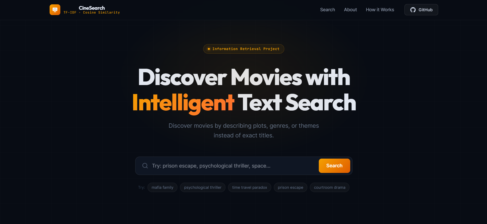
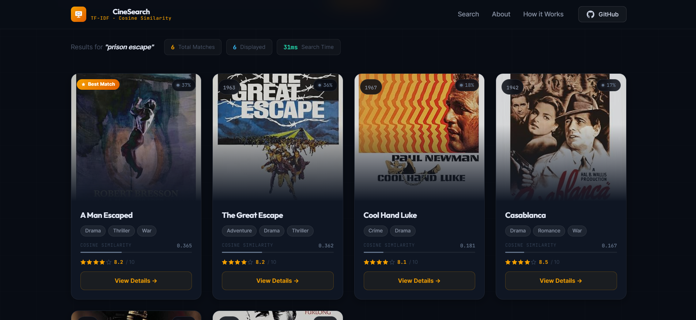
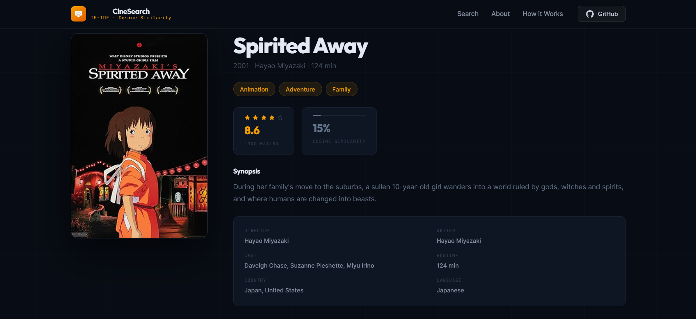
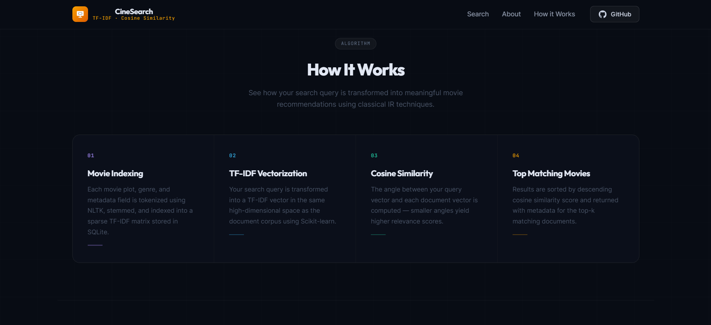
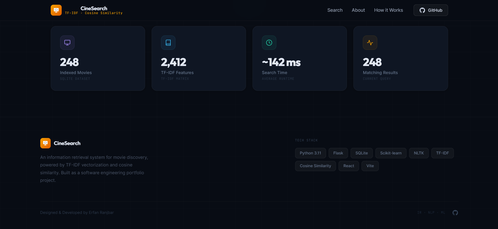

# 🎬 Movie Information Retrieval System

A modern **Information Retrieval (IR)** project for searching movies using **TF-IDF vectorization** and **Cosine Similarity ranking**. The system provides a Flask-powered search API and a fully responsive React frontend with a cinematic UI.

---

## ✨ Features

* 🔍 **TF-IDF based movie search**
* 📊 **Cosine similarity ranking**
* 🎞️ Responsive **React + Vite** frontend
* 🐍 **Flask REST API** backend
* 🗄️ **SQLite movie database**
* 📱 Mobile, tablet, and desktop responsive design
* ⚡ Fast search with precomputed TF-IDF matrix
* 🎨 Cinematic dark-themed user interface

---

## 🚀 Quick Start

```bash
# Backend
pip install -r requirements.txt
python app.py

# Frontend
cd frontend
npm install
npm run dev
```

Then open **http://localhost:5173** in your browser.

---

## 🖼️ Preview

### 🏠 Home Page



---

### 🔍 Search Results



---

### 🎬 Movie Details



---

### ⚙️ How It Works



---

### ℹ️ About Section



---

## 🏗️ Project Structure

```text
Movie-Information-Retrieval/
├── app.py
├── requirements.txt
├── screenshots/
├── README.md
├── data/
│   └── movies.db
├── src/
│   ├── database.py
│   ├── preprocessing.py
│   ├── search_engine.py
│   └── vectorizer.py
└── frontend/
    ├── src/
    │   ├── components/
    │   ├── services/
    │   ├── App.tsx
    │   ├── data.ts
    │   ├── hooks.ts
    │   ├── index.css
    │   ├── main.tsx
    │   └── types.ts
    ├── index.html
    ├── package.json
    ├── package-lock.json
    ├── tsconfig.json
    └── vite.config.ts
```

---

## 🧠 How It Works

### 1. Movie Indexing

Movie metadata (`Title`, `Genre`, `Plot`) is loaded from SQLite and preprocessed using **NLTK**.

### 2. TF-IDF Vectorization

The backend builds a **TF-IDF matrix** using **Scikit-learn**:

```python
vectorizer, tfidf_matrix, movies = build_tfidf(movies)
```

### 3. Query Processing

The user's search query is transformed into the same vector space as the movie corpus.

### 4. Cosine Similarity Ranking

Similarity scores are computed between the query vector and all movie vectors, and the highest-scoring movies are returned.

---

## 📱 Responsive Design

The UI is fully responsive and optimized for:

* 📱 **Mobile**
* 📲 **Tablet**
* 💻 **Desktop**

Responsive behavior is handled using a custom `useResponsive()` hook and adaptive grid layouts.

---

## 🛠️ Tech Stack

### Frontend

* **React**
* **TypeScript**
* **Vite**
* **CSS (inline + custom styles)**

### Backend

* **Python**
* **Flask**
* **Flask-CORS**
* **Pandas**
* **Scikit-learn**
* **NLTK**

### Database

* **SQLite**

---

## 📊 Example Search

**Query**

```text
psychological thriller
```

**Top Results**

| Movie                    | Relevance Score |
| ------------------------ | --------------- |
| Shutter Island           | 0.154           |
| Se7en                    | 0.142           |
| The Silence of the Lambs | 0.137           |

---

## 💡 Possible Improvements

* [ ] BM25 ranking
* [ ] Genre and year filters
* [ ] Related movie recommendations
* [ ] User watchlist
* [ ] Search history
* [ ] Poster caching
* [ ] Deployment with Docker

---

## 👨‍💻 Author

**Mohammad Erfan Ranjbarkohan**

* 🎓 Computer Engineering Student
* 🏫 University of Science and Culture
* 🔗 GitHub: [Erfan22R](https://github.com/Erfan22R)
* 💼 LinkedIn: [Mohammad Erfan Ranjbarkohan](https://www.linkedin.com/in/erfan-ranjbar-ab19a3358)

---

## ⭐ If You Like This Project

If this project helped you or you found it interesting, please consider **starring the repository** ⭐

---

### Powered by **Flask REST API**, **React + Vite**, **SQLite**, and a **TF-IDF / Cosine Similarity Information Retrieval Engine**
